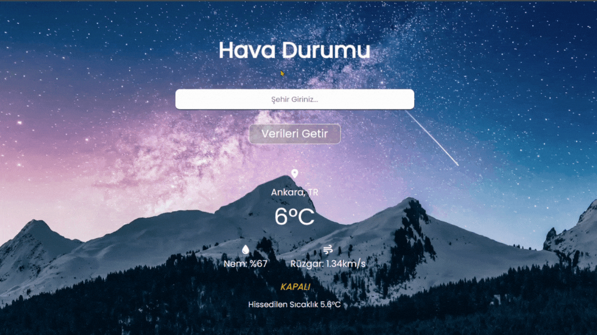

# Weather-Project

This is a simple weather application built with JavaScript that fetches current weather data from the OpenWeatherMap API based on user input.

## Features
- Allows users to enter the name of a city.
- Retrieves current weather data including temperature, humidity, wind speed, and weather description for the entered city.
- Displays the retrieved weather information to the user.

## Technologies Used
- HTML
- CSS
- JavaScript

## gif
